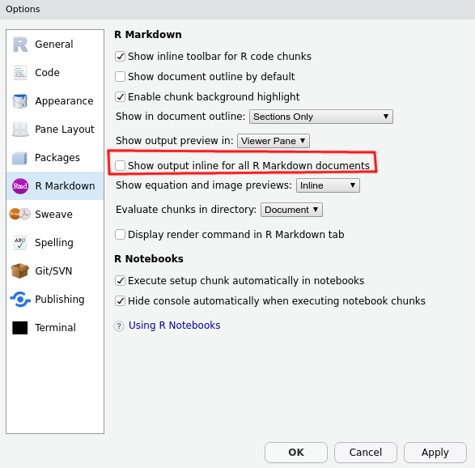

<style type="text/css">
.title-slide {
  background-image: url('assets/sharon-mccutcheon-576867-unsplash.jpg');
  background-size: cover;
  background-position: center;
  background-blend-mode: lighten;
}
</style>

## Qui suis-je ?

<style type="text/css">
img[src*="Slack"] {
  vertical-align: bottom;
}
.twitter svg {
  fill: #1da1f2;
}
.tenor-gif-embed {
  display: inline-block;
  vertical-align: middle;
}
</style>


- administrateur de l'Insee

- utilisateur de R depuis ~ 10 ans
  * occasionnel pendant 8 ans, plus intense depuis 2 ans
  * **fan absolu de R Markdown**

- où suis-je ?
  <div style="width:100%;">
  <div style="display:inline-block;margin-right:20px;">
   🇫🇷 **grrr**  
  **Rejoignez-nous !**  
  [frama.link/r-grrr](https://frama.link/r-grrr)
  </div>
  <!--html_preserve--><div class="tenor-gif-embed" data-postid="7404986" data-share-method="host" data-width="40%" data-aspect-ratio="1.7777777777777777">
<a href="https://tenor.com/view/snoopy-dance-happy-emotion-response-gif-7404986">Snoopy Dance GIF</a>
from
<a href="https://tenor.com/search/snoopy-gifs">Snoopy GIFs</a>
</div>
<script type="text/javascript" src="https://tenor.com/embed.js" async="true"></script><!--/html_preserve-->
  <div style="display:inline-block;margin-left:20px;">
  
  [<svg style="height:0.8em;top:.04em;position:relative;" viewBox="0 0 496 512"><path d="M165.9 397.4c0 2-2.3 3.6-5.2 3.6-3.3.3-5.6-1.3-5.6-3.6 0-2 2.3-3.6 5.2-3.6 3-.3 5.6 1.3 5.6 3.6zm-31.1-4.5c-.7 2 1.3 4.3 4.3 4.9 2.6 1 5.6 0 6.2-2s-1.3-4.3-4.3-5.2c-2.6-.7-5.5.3-6.2 2.3zm44.2-1.7c-2.9.7-4.9 2.6-4.6 4.9.3 2 2.9 3.3 5.9 2.6 2.9-.7 4.9-2.6 4.6-4.6-.3-1.9-3-3.2-5.9-2.9zM244.8 8C106.1 8 0 113.3 0 252c0 110.9 69.8 205.8 169.5 239.2 12.8 2.3 17.3-5.6 17.3-12.1 0-6.2-.3-40.4-.3-61.4 0 0-70 15-84.7-29.8 0 0-11.4-29.1-27.8-36.6 0 0-22.9-15.7 1.6-15.4 0 0 24.9 2 38.6 25.8 21.9 38.6 58.6 27.5 72.9 20.9 2.3-16 8.8-27.1 16-33.7-55.9-6.2-112.3-14.3-112.3-110.5 0-27.5 7.6-41.3 23.6-58.9-2.6-6.5-11.1-33.3 2.6-67.9 20.9-6.5 69 27 69 27 20-5.6 41.5-8.5 62.8-8.5s42.8 2.9 62.8 8.5c0 0 48.1-33.6 69-27 13.7 34.7 5.2 61.4 2.6 67.9 16 17.7 25.8 31.5 25.8 58.9 0 96.5-58.9 104.2-114.8 110.5 9.2 7.9 17 22.9 17 46.4 0 33.7-.3 75.4-.3 83.6 0 6.5 4.6 14.4 17.3 12.1C428.2 457.8 496 362.9 496 252 496 113.3 383.5 8 244.8 8zM97.2 352.9c-1.3 1-1 3.3.7 5.2 1.6 1.6 3.9 2.3 5.2 1 1.3-1 1-3.3-.7-5.2-1.6-1.6-3.9-2.3-5.2-1zm-10.8-8.1c-.7 1.3.3 2.9 2.3 3.9 1.6 1 3.6.7 4.3-.7.7-1.3-.3-2.9-2.3-3.9-2-.6-3.6-.3-4.3.7zm32.4 35.6c-1.6 1.3-1 4.3 1.3 6.2 2.3 2.3 5.2 2.6 6.5 1 1.3-1.3.7-4.3-1.3-6.2-2.2-2.3-5.2-2.6-6.5-1zm-11.4-14.7c-1.6 1-1.6 3.6 0 5.9 1.6 2.3 4.3 3.3 5.6 2.3 1.6-1.3 1.6-3.9 0-6.2-1.4-2.3-4-3.3-5.6-2z"/></svg>]{} [github.com/rlesur](https://github.com/RLesur)  
  
  [<svg style="height:0.8em;top:.04em;position:relative;" viewBox="0 0 512 512"><path d="M459.37 151.716c.325 4.548.325 9.097.325 13.645 0 138.72-105.583 298.558-298.558 298.558-59.452 0-114.68-17.219-161.137-47.106 8.447.974 16.568 1.299 25.34 1.299 49.055 0 94.213-16.568 130.274-44.832-46.132-.975-84.792-31.188-98.112-72.772 6.498.974 12.995 1.624 19.818 1.624 9.421 0 18.843-1.3 27.614-3.573-48.081-9.747-84.143-51.98-84.143-102.985v-1.299c13.969 7.797 30.214 12.67 47.431 13.319-28.264-18.843-46.781-51.005-46.781-87.391 0-19.492 5.197-37.36 14.294-52.954 51.655 63.675 129.3 105.258 216.365 109.807-1.624-7.797-2.599-15.918-2.599-24.04 0-57.828 46.782-104.934 104.934-104.934 30.213 0 57.502 12.67 76.67 33.137 23.715-4.548 46.456-13.32 66.599-25.34-7.798 24.366-24.366 44.833-46.132 57.827 21.117-2.273 41.584-8.122 60.426-16.243-14.292 20.791-32.161 39.308-52.628 54.253z"/></svg>]{.twitter} [\@RLesur](https://twitter.com/RLesur)
  
  </div>
  </div>

  

## Pourquoi utiliser R Markdown ? {data-background=assets/2riz84.jpg data-background-position="50% 75%" data-background-size=70%}

## Pourquoi utiliser R Markdown ? {data-background=assets/2rfny8.jpg data-background-position="50% 75%" data-background-size=70%}

## Pourquoi utiliser R Markdown ? {data-background=assets/2rj0z1.jpg data-background-position="50% 75%" data-background-size=90%}

## Un principe : _Keep it simple_

<!--html_preserve--><div class="columns-2">
<embed src="simple.pdf" type="application/pdf" width="100%" height="500px"/>
<div>
<iframe srcdoc="&lt;!DOCTYPE html&gt;&#10;&lt;html xmlns=&quot;http://www.w3.org/1999/xhtml&quot; lang=&quot;fr&quot; xml:lang=&quot;fr&quot;&gt;&#10;&lt;head&gt;&#10;  &lt;meta charset=&quot;utf-8&quot; /&gt;&#10;  &lt;meta name=&quot;generator&quot; content=&quot;pandoc&quot; /&gt;&#10;  &lt;meta name=&quot;viewport&quot; content=&quot;width=device-width, initial-scale=1.0, user-scalable=yes&quot; /&gt;&#10;  &lt;title&gt;Fichier R Markdown&lt;/title&gt;&#10;  &lt;style type=&quot;text/css&quot;&gt;&#10;      code{white-space: pre-wrap;}&#10;      span.smallcaps{font-variant: small-caps;}&#10;      span.underline{text-decoration: underline;}&#10;      div.column{display: inline-block; vertical-align: top; width: 50%;}&#10;  &lt;/style&gt;&#10;  &lt;style type=&quot;text/css&quot;&gt;&#10;a.sourceLine { display: inline-block; line-height: 1.25; }&#10;a.sourceLine { pointer-events: none; color: inherit; text-decoration: inherit; }&#10;a.sourceLine:empty { height: 1.2em; position: absolute; }&#10;.sourceCode { overflow: visible; }&#10;code.sourceCode { white-space: pre; position: relative; }&#10;div.sourceCode { margin: 1em 0; }&#10;pre.sourceCode { margin: 0; }&#10;@media screen {&#10;div.sourceCode { overflow: auto; }&#10;}&#10;@media print {&#10;code.sourceCode { white-space: pre-wrap; }&#10;a.sourceLine { text-indent: -1em; padding-left: 1em; }&#10;}&#10;pre.numberSource a.sourceLine&#10;  { position: relative; }&#10;pre.numberSource a.sourceLine:empty&#10;  { position: absolute; }&#10;pre.numberSource a.sourceLine::before&#10;  { content: attr(data-line-number);&#10;    position: absolute; left: -5em; text-align: right; vertical-align: baseline;&#10;    border: none; pointer-events: all;&#10;    -webkit-touch-callout: none; -webkit-user-select: none;&#10;    -khtml-user-select: none; -moz-user-select: none;&#10;    -ms-user-select: none; user-select: none;&#10;    padding: 0 4px; width: 4em;&#10;    color: #aaaaaa;&#10;  }&#10;pre.numberSource { margin-left: 3em; border-left: 1px solid #aaaaaa;  padding-left: 4px; }&#10;div.sourceCode&#10;  {  }&#10;@media screen {&#10;a.sourceLine::before { text-decoration: underline; }&#10;}&#10;code span.al { color: #ff0000; font-weight: bold; } /* Alert */&#10;code span.an { color: #60a0b0; font-weight: bold; font-style: italic; } /* Annotation */&#10;code span.at { color: #7d9029; } /* Attribute */&#10;code span.bn { color: #40a070; } /* BaseN */&#10;code span.bu { } /* BuiltIn */&#10;code span.cf { color: #007020; font-weight: bold; } /* ControlFlow */&#10;code span.ch { color: #4070a0; } /* Char */&#10;code span.cn { color: #880000; } /* Constant */&#10;code span.co { color: #60a0b0; font-style: italic; } /* Comment */&#10;code span.cv { color: #60a0b0; font-weight: bold; font-style: italic; } /* CommentVar */&#10;code span.do { color: #ba2121; font-style: italic; } /* Documentation */&#10;code span.dt { color: #902000; } /* DataType */&#10;code span.dv { color: #40a070; } /* DecVal */&#10;code span.er { color: #ff0000; font-weight: bold; } /* Error */&#10;code span.ex { } /* Extension */&#10;code span.fl { color: #40a070; } /* Float */&#10;code span.fu { color: #06287e; } /* Function */&#10;code span.im { } /* Import */&#10;code span.in { color: #60a0b0; font-weight: bold; font-style: italic; } /* Information */&#10;code span.kw { color: #007020; font-weight: bold; } /* Keyword */&#10;code span.op { color: #666666; } /* Operator */&#10;code span.ot { color: #007020; } /* Other */&#10;code span.pp { color: #bc7a00; } /* Preprocessor */&#10;code span.sc { color: #4070a0; } /* SpecialChar */&#10;code span.ss { color: #bb6688; } /* SpecialString */&#10;code span.st { color: #4070a0; } /* String */&#10;code span.va { color: #19177c; } /* Variable */&#10;code span.vs { color: #4070a0; } /* VerbatimString */&#10;code span.wa { color: #60a0b0; font-weight: bold; font-style: italic; } /* Warning */&#10;  &lt;/style&gt;&#10;  &lt;!--[if lt IE 9]&gt;&#10;    &lt;script src=&quot;//cdnjs.cloudflare.com/ajax/libs/html5shiv/3.7.3/html5shiv-printshiv.min.js&quot;&gt;&lt;/script&gt;&#10;  &lt;![endif]--&gt;&#10;&lt;/head&gt;&#10;&lt;body&gt;&#10;&lt;header&gt;&#10;&lt;h1 class=&quot;title&quot;&gt;Fichier R Markdown&lt;/h1&gt;&#10;&lt;/header&gt;&#10;&lt;div class=&quot;sourceCode&quot; id=&quot;cb1&quot;&gt;&lt;pre class=&quot;sourceCode markdown&quot;&gt;&lt;code class=&quot;sourceCode markdown&quot;&gt;&lt;a class=&quot;sourceLine&quot; id=&quot;cb1-1&quot; data-line-number=&quot;1&quot;&gt;---&lt;/a&gt;&#10;&lt;a class=&quot;sourceLine&quot; id=&quot;cb1-2&quot; data-line-number=&quot;2&quot;&gt;title: &amp;quot;Keep It Simple&amp;quot;&lt;/a&gt;&#10;&lt;a class=&quot;sourceLine&quot; id=&quot;cb1-3&quot; data-line-number=&quot;3&quot;&gt;author: &amp;quot;Romain Lesur&amp;quot;&lt;/a&gt;&#10;&lt;a class=&quot;sourceLine&quot; id=&quot;cb1-4&quot; data-line-number=&quot;4&quot;&gt;output: &lt;/a&gt;&#10;&lt;a class=&quot;sourceLine&quot; id=&quot;cb1-5&quot; data-line-number=&quot;5&quot;&gt;  pdf_document:&lt;/a&gt;&#10;&lt;a class=&quot;sourceLine&quot; id=&quot;cb1-6&quot; data-line-number=&quot;6&quot;&gt;&lt;span class=&quot;bn&quot;&gt;    df_print: kable&lt;/span&gt;&lt;/a&gt;&#10;&lt;a class=&quot;sourceLine&quot; id=&quot;cb1-7&quot; data-line-number=&quot;7&quot;&gt;---&lt;/a&gt;&#10;&lt;a class=&quot;sourceLine&quot; id=&quot;cb1-8&quot; data-line-number=&quot;8&quot;&gt;&lt;/a&gt;&#10;&lt;a class=&quot;sourceLine&quot; id=&quot;cb1-9&quot; data-line-number=&quot;9&quot;&gt;```{r setup, include=FALSE}&lt;/a&gt;&#10;&lt;a class=&quot;sourceLine&quot; id=&quot;cb1-10&quot; data-line-number=&quot;10&quot;&gt;knitr::opts_chunk$set(echo = FALSE, message = FALSE)&lt;/a&gt;&#10;&lt;a class=&quot;sourceLine&quot; id=&quot;cb1-11&quot; data-line-number=&quot;11&quot;&gt;```&lt;/a&gt;&#10;&lt;a class=&quot;sourceLine&quot; id=&quot;cb1-12&quot; data-line-number=&quot;12&quot;&gt;&lt;/a&gt;&#10;&lt;a class=&quot;sourceLine&quot; id=&quot;cb1-13&quot; data-line-number=&quot;13&quot;&gt;&lt;span class=&quot;fu&quot;&gt;## Introduction&lt;/span&gt;&lt;/a&gt;&#10;&lt;a class=&quot;sourceLine&quot; id=&quot;cb1-14&quot; data-line-number=&quot;14&quot;&gt;&lt;/a&gt;&#10;&lt;a class=&quot;sourceLine&quot; id=&quot;cb1-15&quot; data-line-number=&quot;15&quot;&gt;Quelques mots sur les données.&lt;/a&gt;&#10;&lt;a class=&quot;sourceLine&quot; id=&quot;cb1-16&quot; data-line-number=&quot;16&quot;&gt;&lt;/a&gt;&#10;&lt;a class=&quot;sourceLine&quot; id=&quot;cb1-17&quot; data-line-number=&quot;17&quot;&gt;&lt;span class=&quot;fu&quot;&gt;## Du texte et un graphique&lt;/span&gt;&lt;/a&gt;&#10;&lt;a class=&quot;sourceLine&quot; id=&quot;cb1-18&quot; data-line-number=&quot;18&quot;&gt;&lt;/a&gt;&#10;&lt;a class=&quot;sourceLine&quot; id=&quot;cb1-19&quot; data-line-number=&quot;19&quot;&gt;Lorem ipsum dolor sit amet, consectetur adipiscing elit. Maecenas euismod, dolor at faucibus finibus, lacus nunc gravida mauris, ac porttitor felis turpis a purus. Mauris aliquam risus ut erat accumsan, id gravida purus dignissim. Donec tortor est, fringilla sit amet magna at, mattis pulvinar erat. Aenean tellus ante, rutrum non purus eu, commodo vehicula leo. Mauris congue urna nec tristique eleifend. Sed tincidunt vel justo id pellentesque. Proin sagittis fermentum tellus, eu viverra neque eleifend at. Suspendisse potenti.&lt;/a&gt;&#10;&lt;a class=&quot;sourceLine&quot; id=&quot;cb1-20&quot; data-line-number=&quot;20&quot;&gt;&lt;/a&gt;&#10;&lt;a class=&quot;sourceLine&quot; id=&quot;cb1-21&quot; data-line-number=&quot;21&quot;&gt;Source du graphique : http://r-statistics.co/Top50-Ggplot2-Visualizations-MasterList-R-Code.html&lt;/a&gt;&#10;&lt;a class=&quot;sourceLine&quot; id=&quot;cb1-22&quot; data-line-number=&quot;22&quot;&gt;&lt;/a&gt;&#10;&lt;a class=&quot;sourceLine&quot; id=&quot;cb1-23&quot; data-line-number=&quot;23&quot;&gt;```{r graphique, fig.height=4}&lt;/a&gt;&#10;&lt;a class=&quot;sourceLine&quot; id=&quot;cb1-24&quot; data-line-number=&quot;24&quot;&gt;library(ggplot2)&lt;/a&gt;&#10;&lt;a class=&quot;sourceLine&quot; id=&quot;cb1-25&quot; data-line-number=&quot;25&quot;&gt;library(quantmod)&lt;/a&gt;&#10;&lt;a class=&quot;sourceLine&quot; id=&quot;cb1-26&quot; data-line-number=&quot;26&quot;&gt;data(&amp;quot;economics&amp;quot;, package = &amp;quot;ggplot2&amp;quot;)&lt;/a&gt;&#10;&lt;a class=&quot;sourceLine&quot; id=&quot;cb1-27&quot; data-line-number=&quot;27&quot;&gt;&lt;/a&gt;&#10;&lt;a class=&quot;sourceLine&quot; id=&quot;cb1-28&quot; data-line-number=&quot;28&quot;&gt;&lt;span class=&quot;fu&quot;&gt;# Compute % Returns&lt;/span&gt;&lt;/a&gt;&#10;&lt;a class=&quot;sourceLine&quot; id=&quot;cb1-29&quot; data-line-number=&quot;29&quot;&gt;economics$returns_perc &amp;lt;- c(0, diff(economics$psavert)/economics$psavert[-length(economics$psavert)])&lt;/a&gt;&#10;&lt;a class=&quot;sourceLine&quot; id=&quot;cb1-30&quot; data-line-number=&quot;30&quot;&gt;&lt;/a&gt;&#10;&lt;a class=&quot;sourceLine&quot; id=&quot;cb1-31&quot; data-line-number=&quot;31&quot;&gt;&lt;span class=&quot;fu&quot;&gt;# Create break points and labels for axis ticks&lt;/span&gt;&lt;/a&gt;&#10;&lt;a class=&quot;sourceLine&quot; id=&quot;cb1-32&quot; data-line-number=&quot;32&quot;&gt;brks &amp;lt;- economics$date[seq(1, length(economics$date), 12)]&lt;/a&gt;&#10;&lt;a class=&quot;sourceLine&quot; id=&quot;cb1-33&quot; data-line-number=&quot;33&quot;&gt;lbls &amp;lt;- lubridate::year(economics$date[seq(1, length(economics$date), 12)])&lt;/a&gt;&#10;&lt;a class=&quot;sourceLine&quot; id=&quot;cb1-34&quot; data-line-number=&quot;34&quot;&gt;&lt;/a&gt;&#10;&lt;a class=&quot;sourceLine&quot; id=&quot;cb1-35&quot; data-line-number=&quot;35&quot;&gt;&lt;span class=&quot;fu&quot;&gt;# Plot&lt;/span&gt;&lt;/a&gt;&#10;&lt;a class=&quot;sourceLine&quot; id=&quot;cb1-36&quot; data-line-number=&quot;36&quot;&gt;ggplot(economics[1:100, ], aes(date, returns_perc)) + &lt;/a&gt;&#10;&lt;a class=&quot;sourceLine&quot; id=&quot;cb1-37&quot; data-line-number=&quot;37&quot;&gt;  geom_area() + &lt;/a&gt;&#10;&lt;a class=&quot;sourceLine&quot; id=&quot;cb1-38&quot; data-line-number=&quot;38&quot;&gt;  scale_x_date(breaks=brks, labels=lbls) + &lt;/a&gt;&#10;&lt;a class=&quot;sourceLine&quot; id=&quot;cb1-39&quot; data-line-number=&quot;39&quot;&gt;  theme(axis.text.x = element_text(angle=90)) + &lt;/a&gt;&#10;&lt;a class=&quot;sourceLine&quot; id=&quot;cb1-40&quot; data-line-number=&quot;40&quot;&gt;  labs(title=&amp;quot;Area Chart&amp;quot;, &lt;/a&gt;&#10;&lt;a class=&quot;sourceLine&quot; id=&quot;cb1-41&quot; data-line-number=&quot;41&quot;&gt;&lt;span class=&quot;bn&quot;&gt;       subtitle = &amp;quot;Perc Returns for Personal Savings&amp;quot;, &lt;/span&gt;&lt;/a&gt;&#10;&lt;a class=&quot;sourceLine&quot; id=&quot;cb1-42&quot; data-line-number=&quot;42&quot;&gt;&lt;span class=&quot;bn&quot;&gt;       y=&amp;quot;% Returns for Personal savings&amp;quot;, &lt;/span&gt;&lt;/a&gt;&#10;&lt;a class=&quot;sourceLine&quot; id=&quot;cb1-43&quot; data-line-number=&quot;43&quot;&gt;&lt;span class=&quot;bn&quot;&gt;       caption=&amp;quot;Source: economics&amp;quot;)&lt;/span&gt;&lt;/a&gt;&#10;&lt;a class=&quot;sourceLine&quot; id=&quot;cb1-44&quot; data-line-number=&quot;44&quot;&gt;```&lt;/a&gt;&#10;&lt;a class=&quot;sourceLine&quot; id=&quot;cb1-45&quot; data-line-number=&quot;45&quot;&gt;&lt;/a&gt;&#10;&lt;a class=&quot;sourceLine&quot; id=&quot;cb1-46&quot; data-line-number=&quot;46&quot;&gt;&lt;span class=&quot;fu&quot;&gt;## Un tableau avec quelques données&lt;/span&gt;&lt;/a&gt;&#10;&lt;a class=&quot;sourceLine&quot; id=&quot;cb1-47&quot; data-line-number=&quot;47&quot;&gt;&lt;/a&gt;&#10;&lt;a class=&quot;sourceLine&quot; id=&quot;cb1-48&quot; data-line-number=&quot;48&quot;&gt;Voici un petit tableau :&lt;/a&gt;&#10;&lt;a class=&quot;sourceLine&quot; id=&quot;cb1-49&quot; data-line-number=&quot;49&quot;&gt;&lt;/a&gt;&#10;&lt;a class=&quot;sourceLine&quot; id=&quot;cb1-50&quot; data-line-number=&quot;50&quot;&gt;```{r tableau}&lt;/a&gt;&#10;&lt;a class=&quot;sourceLine&quot; id=&quot;cb1-51&quot; data-line-number=&quot;51&quot;&gt;head(economics, n = 3L)&lt;/a&gt;&#10;&lt;a class=&quot;sourceLine&quot; id=&quot;cb1-52&quot; data-line-number=&quot;52&quot;&gt;```&lt;/a&gt;&lt;/code&gt;&lt;/pre&gt;&lt;/div&gt;&#10;&lt;/body&gt;&#10;&lt;/html&gt;" style="height:500px!important;"></iframe>
</div>
</div><!--/html_preserve-->

## Prise en main dans RStudio

- RStudio : compagnon idéal 
  * Menu `File > New File > R Markdown...`
  * Conseil : désactiver le mode _notebook_   
  `Tools > Global Options` <!--html_preserve--><!--/html_preserve-->
- pour les pdf, si vous n'avez pas $\LaTeX$ d'installé, utilisez le package [`tinytex`](https://cran.r-project.org/package=tinytex)
[_demo..._]{style="float:right;padding-top:40px;"}

## Concepts de base de R Markdown

1. En-tête `YAML` : indications données au package [`rmarkdown`](https://bookdown.org/yihui/rmarkdown/) (type de document souhaité, options, méta-données...)

1. _Chunks_ : code dont le résulat sera inséré dans le document final (➡️ [`knitr`](https://yihui.name/knitr/))

1. `Markdown` : une façon simple d'écrire du texte (➡️ [`pandoc`](https://pandoc.org/MANUAL.html#pandocs-markdown))

Introduction en 🇫🇷

- Julien Barnier : <https://juba.github.io/tidyverse/13-rmarkdown.html>

## En-tête du document

```yaml
---
title: Créez vos documents avec R Markdown
author: Romain Lesur
date: 21 janvier 2019
output: 
  ioslides_presentation:
    widescreen: true
    self_contained: false
    logo: "assets/meetuprnantes.jpeg"
    keep_md: true
---
```

[<svg style="height:0.8em;top:.04em;position:relative;fill:red;" viewBox="0 0 576 512"><path d="M569.517 440.013C587.975 472.007 564.806 512 527.94 512H48.054c-36.937 0-59.999-40.055-41.577-71.987L246.423 23.985c18.467-32.009 64.72-31.951 83.154 0l239.94 416.028zM288 354c-25.405 0-46 20.595-46 46s20.595 46 46 46 46-20.595 46-46-20.595-46-46-46zm-43.673-165.346l7.418 136c.347 6.364 5.609 11.346 11.982 11.346h48.546c6.373 0 11.635-4.982 11.982-11.346l7.418-136c.375-6.874-5.098-12.654-11.982-12.654h-63.383c-6.884 0-12.356 5.78-11.981 12.654z"/></svg> **Attention à l'indentation**]{}

## Multipliez les format de sortie

Avec `output`, vous pouvez produire plusieurs formats à partir du même fichier source : 

```yaml
---
title: Créez vos documents avec R Markdown
author: Romain Lesur
date: 21 janvier 2019
output: 
  html_document: default
  pdf_document: default
---
```

Exécuter dans la console :

```r
rmarkdown::render("monfichier.Rmd", output_format = "all")
```

## Type de documents

Vous pouvez produire :

- des documents HTML
- des documents paginés (articles, livres, thèses) : pdf avec $\LaTeX$, docx, odt...
- des présentations : HTML et pptx
- des tableaux de bord
- des cours et sujets d'examens
- des sites internet statiques

## Modèles prêts à l'emploi

De nombreux packages fournissent des modèles prêts à l'emploi : `rmarkdown`, `flexdashboard`, `hrbrthemes`, `komadown`, `komaletter`, `learnr`, `linl`, `memor`, [`papaja`](https://github.com/crsh/papaja), `pinp`, `prettydoc`, `radix`, `revealjs`, `rmdformats`, `rmdshower`, `rticles`, `tufte`, [`unilur`](https://koncina.github.io/unilur/), `vitae`, `xaringan`...

Pour les livres et thèses : `bookdown`

Pour les sites web : `blogdown`

## Des packages pour aider sur des taches spécifiques

Tout un écosystème de packages pour aider : 

- l'incroyable `officer` de David Gohel pour MS Office
- `tinytex` pour installer facilement $\LaTeX$
- pour les tableaux : `flextable` (David Gohel), `kableExtra`, `gt`...

## Des documents paramétrés

A partir du même fichier R Markdown, produire des rapports sur différentes zones géographiques, différentes périodes...

```yaml
---
title: My Document
output: html_document
params:
  annee: 2018
  region: Europe
---
```

Disponible depuis le bouton `Knit` de RStudio ou

```r
rmarkdown::render("monfichier.Rmd", params = list(annee = 2018, region = Europe))
```

## `knitr` chunks {data-background="assets/2rg8dc.jpg" data-background-position="50% 75%" data-background-size="35%"}

## Deux façons d'insérer du code dans son document

1. Code chunk  

    ````r
    ```{r, eval=TRUE, echo=FALSE}
    head(mtcars)
    ```
    ````
    
    De nombreuses options ! [yihui.name/knitr/options](https://yihui.name/knitr/options/)
    
1. Inline code 

    ````markdown
    La moyenne est de `r mean(mtcars$cyl)`.
    ````

## Différents langages autorisés


```r
names(knitr::knit_engines$get())
```

```
##  [1] "awk"       "bash"      "coffee"    "gawk"      "groovy"   
##  [6] "haskell"   "lein"      "mysql"     "node"      "octave"   
## [11] "perl"      "psql"      "Rscript"   "ruby"      "sas"      
## [16] "scala"     "sed"       "sh"        "stata"     "zsh"      
## [21] "highlight" "Rcpp"      "tikz"      "dot"       "c"        
## [26] "fortran"   "fortran95" "asy"       "cat"       "asis"     
## [31] "stan"      "block"     "block2"    "js"        "css"      
## [36] "sql"       "go"        "python"    "julia"
```

## Exemple : `python` avec le package `reticulate` {.smaller}


1. Initialisation de la configuration

    ````r
    ```{r, include=FALSE}
    library(reticulate)
    use_python("usr/local/bin/python")
    use_virtualenv("r-reticulate")
    py_install(c("pandas", "numpy"))
    ```
    ````

1. Script python

    ````py
    ```{python}
    a = 1
    print(a)
    ```
    ````

    
    ```
    ## 1
    ```

## Communication entre R et python {.smaller}


````py
```{python}
import pandas as pd
import numpy as np

dates = pd.date_range('20130101', periods=6)
df = pd.DataFrame(np.random.randn(6,4), index=dates, columns=list('ABCD'))
```
````

````r
```{r}
head(py$df, n = 2L)
```
````
<div class="kable-table">

                      A           B            C            D
-----------  ----------  ----------  -----------  -----------
2013-01-01    0.2952525   -1.126555    0.9311392    1.3895048
2013-01-02    0.4104249   -1.201973   -0.1641902   -0.7289867

</div>

## Exemple : `node.js` avec un script externe {.smaller}

Vous voulez écrire un cours sur `node.js`.  
Vos scripts sont dans des fichiers `.js`.

Vous pouvez écrire :

````markdown
```{node, code=readLines('node/example.js')}
```
````


```javascript
const hi = (name) => {
  console.log("Hello " + name + "!");
};

hi("Bob");
```

```
## Hello Bob!
```

Voir le repo source : <https://github.com/RLesur/meetup-r-nantes-rmd>

## Exemple : `SQL` avec scripts externes


**Etape 1 : connexion à la base de données**  
````r
```{r, include=FALSE}
conn <- DBI::dbConnect(RSQLite::SQLite(), path = ":memory:")
```
````

````markdown
```{sql, connection=conn, code=readLines('sql/list_tables.sql')}
```
````


```sql
SELECT name FROM sqlite_master WHERE type='table';
```


<div class="knitsql-table">


Table: 1 records

|name   |
|:------|
|mtcars |

</div>

---

````markdown
```{sql, connection=conn, code=readLines('sql/data.sql')}
```
````


```sql
SELECT mpg, cyl, disp FROM mtcars
       LIMIT 2;
```


<div class="knitsql-table">


Table: 2 records

 mpg   cyl   disp
----  ----  -----
  21     6    160
  21     6    160

</div>

**Se déconnecter :**  
````r
```{r, echo=FALSE}
DBI::dbDisconnect(conn)
```
````


## Markdown : simple mais puissant {data-background="assets/2rfogh.jpg" data-background-position="10% 75%" data-background-size="45%"}

<div style="padding-left:55%;">
**Lisez la documentation de Pandoc au moins une fois !**

**[pandoc.org/MANUAL#pandocs-markdown](https://pandoc.org/MANUAL#pandocs-markdown)**

</div>

## R Markdown Cheat Sheet

<style type="text/css">
.license {
  font-size: 70%;
  position: absolute;
  top: 100px;
}
</style>

[[R Markdown Cheat Sheet](https://github.com/rstudio/cheatsheets/raw/master/rmarkdown-2.0.pdf) par [RStudio](https://www.rstudio.com/), licence [CC BY 4.0](https://creativecommons.org/licenses/by/4.0/)]{.license}

<!--html_preserve--><embed id="cheatsheet" src="https://drive.google.com/viewerng/viewer?embedded=true&amp;url=https://github.com/rstudio/cheatsheets/raw/master/rmarkdown-2.0.pdf" width="100%" height="500px"/><!--/html_preserve-->

## Le fonctionnement de R Markdown

Le package `rmarkdown` assure la bonne exécution des étapes suivantes :

- fichier `.Rmd` ➡️ fichier `.md` = `knitr`  
  Exécution des chunks et insertion du résultat

- fichier `.md` ➡️ fichier `.html` ou `.tex`, `.docx`, `.odt`... = **Pandoc**
  
Pour les pdf avec $\LaTeX$, étape supplémentaire :

- fichier `.tex` ➡️ fichier `.pdf` = $\LaTeX$ 

## Hacker R Markdown

On peut aller très loin dans l'adaptation de R Markdown

- Hacker RStudio

- Hacker R Markdown

- Hacker `knitr`

- Hacker `pandoc`

## Hacker RStudio

_Exemple : Hacker le bouton `knit` de RStudio_

Rajouter dans l'en-tête YAML du fichier `Rmd` une ligne qui renvoie une fonction $\lambda$ ayant pour arguments `(inputFile, encoding)`

```yaml
knit: (function(inputFile, encoding){...})
```

Si en plus la fonction comprend `message("Output created: ", outputFile)`, le viewer de RStudio l'ouvrira.

Voir <https://github.com/rstudio/rmarkdown/issues/277>

## Hacker R Markdown

On peut créer des nouveaux formats avec `rmarkdown::output_format()` :

```r
function (knitr, pandoc, keep_md = FALSE, clean_supporting = TRUE, 
    df_print = NULL, pre_knit = NULL, post_knit = NULL, pre_processor = NULL, 
    intermediates_generator = NULL, post_processor = NULL, on_exit = NULL, 
    base_format = NULL) 
```

- `knitr` et `pandoc` : options passées à `knitr` et `pandoc`

- `pre_knit`, `post_knit`, `pre_processor`, `intermediates_generator`, `post_processor` et `on_exit` : des fonctions appelées à chaque étape de la génération du document

## Hacker `knitr` {.smaller}

Des dizaines d'options...  
**Exemple : _hooks_** 

`` `r pi` `` donne par défaut :  3.1415927.  
Mais on voudrait avoir des `,` à la place des `.`

Avec le _hook_ suivant, on peut modifier le comportement des _inlines codes_ :


```r
default_hook <- knitr::knit_hooks$get()$inline
knitr::knit_hooks$set(inline = function(x) {
  default_text <- default_hook(x)
  if (!is.numeric(x))
    return(default_text)
  gsub("\\.", ",", default_text)
})
```

Et maintenant `` `r pi` `` donne 3,1415927.

## Hacker `pandoc`

Lorsque `pandoc` transforme un document d'un format vers un autre, il passe par une représentation sous forme arbre syntaxique abstrait (qu'on peut sérialiser en JSON, par ex.).  
On peut modifier cet AST grâce à des filtres, voir <https://pandoc.org/filters.html>.

Langages acceptés : tous (!)  
`lua` privilégié depuis pandoc 2

Egalement la possibilité de développer son propre sérialiseur : <https://pandoc.org/MANUAL.html#custom-writers>

## Références

Xie, Y., J.J. Allaire et G. Grolemund _R Markdown: The Definitive Guide_ <https://bookdown.org/yihui/rmarkdown/>

Xie, Y. _`knitr` Elegant, flexible, and fast dynamic report generation with R_ <https://yihui.name/knitr/>

En cours de rédaction :  
Harper M. et Y. Xie _R Markdown Cookbook_ <https://dr-harper.github.io/rmarkdown-cookbook/>

